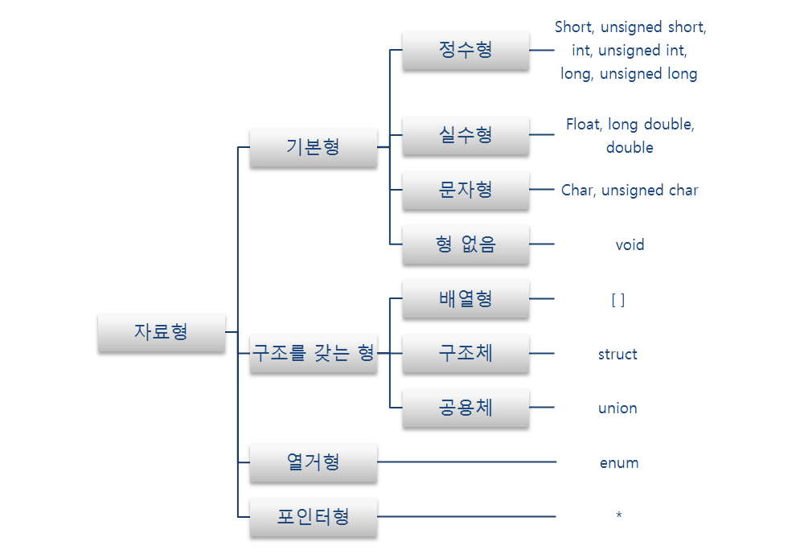

c언어 자료형
자료형의 정의: 가상메모리에 할당된 공간을 일정 크기로 구분해서 특정한 의미를 부여한 뒤 해석하는 것

정수형,문자형(char)
|자료형/명칭|크기|형식지정자|
|---|---|---|
|char|1바이트|%c(문자 한 개)|
|short|2바이트|%d|
|int|4바이트|%d(10진수 정수)|
|long|4바이트|%ld|
|long long|8바이트|%lld|

실수형 or 부동 소수점형
|자료형/명칭|크기|형식지정자|
|---|---|---|
|float|4바이트|%f|
|double|8바이트|%lf|
|long double|8바이트 이상|%Lf|

|구분|명칭|설명|
|---|---|---|
|부호가 있는 변수|signed|기본(default)형식|
|부호가 없는 변수|unsigned|음수를 표현할 수 없고, 양수 값의 표현범위가 두배 정도 늘어남|

정수형은 signed(부호 있는 변수),unsigned(부호 없는 변수)로 나뉘어지는데 
signed의 경우에는 음수와 양수 둘 다 표현 가능, unsigned의 경우에는 양수만 표현하지만 표현범위 2배 늘어남

실수형은 정수형과 달리 unsigned가 존재하지 않는다 

자료형 크기는 바이트로 표현 
비트는 컴퓨터가 처리할 수 있는 데이터의 최소 단위, 하나의 비트는 0 혹은 1의 값을 가진다 
8개의 비트가 모이면 1바이트가 된다
8비트를 이진수로 2의 7승인 128개의 양수와 128개의 음수를 만들 수 있다.