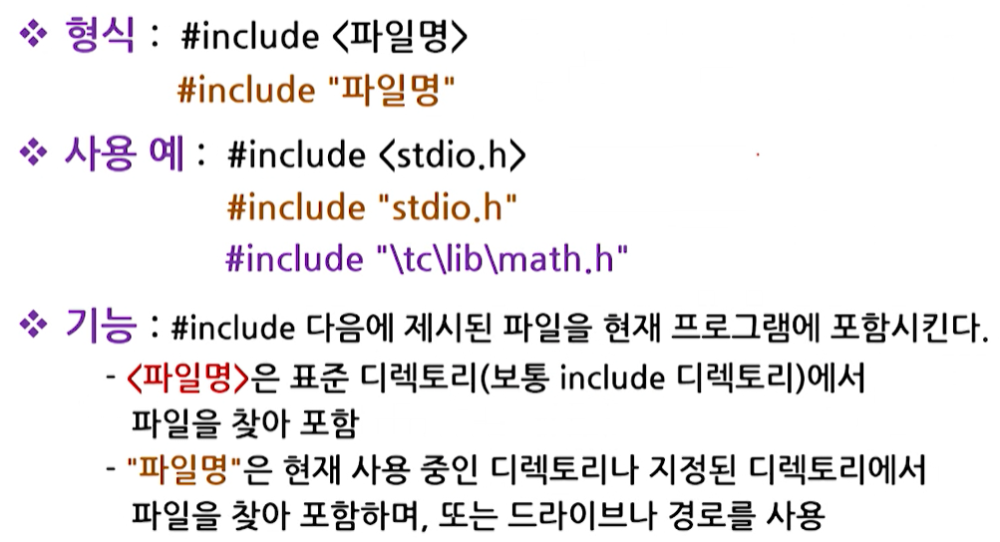
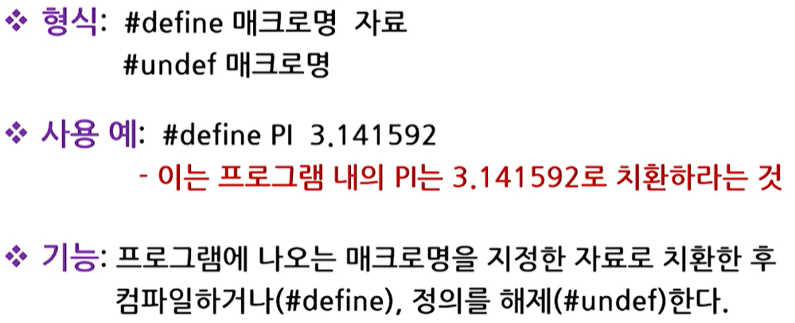
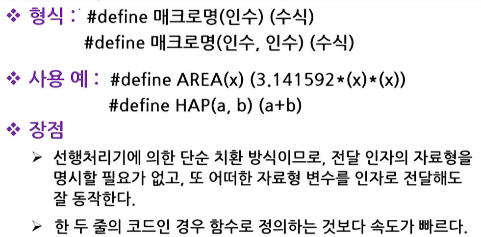
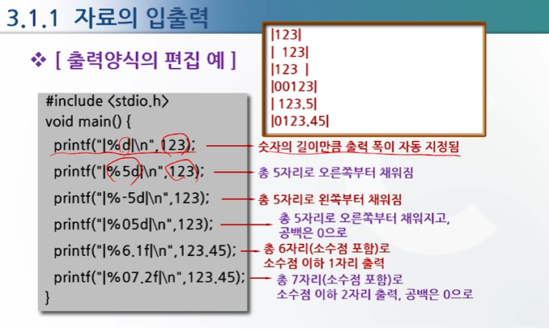
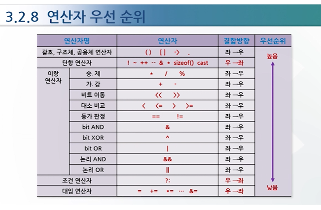

# C언어 1강

### c언어 정의
- c언어:프로그래밍 언어
- 프로그래밍 언어: 사람과 컴파일러가 이해할 수 있도록 약속된 형태의 언어
  - 기계어, 어셈블링, C, C++, C#, JAVA, PHP 등

- c언어:컴파일러가 필요
- 컴파일러: 프로그래밍 언어로 작성된 프로그램을 컴퓨터가 이해할 수 있도록 기계어로 번역해주는 번역기
  - 컴파일러 종류
  - 어셈블러(assembler): 기호로 표현된 어셈블리 코드를 기계어로 번역하는 번역기
  - 인터프리터(interpreter): 소스 프로그램을 한번에 기계어로 변환시키는 컴파일러와 달리 프로그램을 **한 단계씩 기계어로 해석하여 실행하는 '언어처리 프로그램'**  

### c언어의 특징
- 프로그램 이식성이 높다
- 간단한 문법표현으로 함축적인 프로그램 작성이 용이하다
- 저급언어 특성을 가진 고급언어이다

### 프로그램 개발 단계
1. 프로그램 목적 정의: 요구 분석과 시스템 분석을 통하여 프로그램이 가져야 할 기능 정의
2. 프로그램 설계: 분석된 기능을 처릴할 수 있도록 프로그램 구조를 설계
3. 소스코드 작성: 작성된 프로그램 설계를 기반으로 에디터를 사용하여 작성
4. 컴파일 링크: 소스코드를 실행 가능한 코드로 변환하고 문법 검사
5. 프로그램 실행
6. 테스트와 디버깅: 에러를 감시하고 디버깅
7. 유지보수: 사용 중 발생되는 에러나 추가적인 변경사항을 처리

### c 프로그램의 작성 및 준비
- 프로그램 개발 단계
  - 에디터와 컴파일러 필요
  - 에디터: 소스코드를 작성하여 저장할 수 있도록 도와주는 도구
  - c컴파일러: Turbo C/C++, Dev-C++, Visual C++, GCC등

- C프로그램의 완성 과정
  1. 코딩: 주어진 문제에 대한 설계를 바탕으로 소스코드를 작성하여 소스파일(source file)을 생성하는 과정
  2. 컴파일: 소스파일이 목적파일(object file)로 변환되는 과정
  3. 링킹: 목적파일을 실행파일(execution file)로 변환하는 과정

1. 소스파일의 생성
- 코딩을하면 .c라는 확장자를 가진 파일로 저장 
2. 소스파일의 컴파일
- sample.c을 컴파일러를 통해 이진수로 만들어진 목적파일로 바꿔준다 sample.obj
3. 실행파일의 생성(링킹과정)
- 목적파일이랑 다른 목적파일/라이브러리가 합쳐져서 링커를 통해서 실행파일 sample.exe로 바꿔준다 
4. 정리: .c라는 확장자를 가진 파일로 저장을 하고 소스파일을 컴파일러를 통해 목적파일로 바꿔주고 목적파일을 링커를 통해 실행파일로 바꿔준다
- sample.c ->컴파일러->sample.obj ->링커->sample.exe 

## c언어 주요용어
- 컴파일러(compiler) : 프로그래밍 언어로 작성된 프로그램을 기계어로 바꿔주는 번역기

- 소스코드(source code) : 프로그램 안에 있는 명령어

- 목적 파일(object file) : .obj의 확장자를 갖는 파일로 기계어들의 집합으로 이루어진 파일

- 링커(linker) : 여러 목적파일과 라이브러리 파일을 연결해주는 도구

- 예약어(reserved word) : C 언어에서 미리 정의되어 있는 단어

# C언어 2주차 강의-----------------------------------------------------------------------------------------------------

## 상수와 변수
### 상수(constant)
- 항상 고정된 값을 갖는 자료
- 값이 한번 정해지면 프로그램 도중 그 값을 변경할 수 없는 수

### 상수 종류
1. 정수형 상수
2. 실수형 상수
3. 문자형 상수
4. 문자열 상수

1. 정수형 상수
  - 10진수, 8진수, 16진수로 표현

2. 실수형 상수
  - 부동소수점 형 상수
  - double형을 기본 자료형으로 사용

3. 문자형 상수
  - 단일 인용부호('')로 묶여 있는 1개의 영문자나 숫자문자
  - 내부적으로는 해당문자의 ASCII코드값이 사용(예를 들어 'A'는 내부적으로 65아스키코드값이 사용)
  - Escape 문자: 키보드에 나타나 있지 않은 문자(\n,\f등)

4. 문자열 상수
  - 이중 인용부호("")로 묶여 있는 복수개의 영문자나 숫자
  - 기억공간에 보관될 때는 문자열 끝에 null문자가(\0) 추가

### 변수(variable)
- 변할 수 있는 값
- 프로그램에서는 변수는: 프로그램 실행 도중 변할 수 있는 값이 저장되는 기억공간을 의미
- 이러한 변수 속에 들어가는 값은 수시로 변경될 수 있다
- 따라서 변수는 사용 전에 반드시 선언하여 컴파일러가 기억공간에서 일정공간을 확보할 수 있도록 해야 함
### 변수 특징
- 모든 변수는 이름이 있다(변수명)
- 모든 변수는 정해진 자료형이 있다
- 모든 변수는 할당된 값을 갖는다

### 변수명의 정의 규칙
- 모든 변수는 사용되기 전에 선언되어야 한다
- 변수명은 반드시 영문자나 밑줄(_)로 시작해야 한다
- 변수명은 중간에 숫자, 밑줄(_)을 섞어서 명명할 수 있다
- 변수명은 중간에 밑줄(_) 이외의 특수문자($,#,?)를 섞어서 명명할 수 없다
- 변수명은 대,소문자를 구별하여 사용한다
- 변수명은 예약어들은 사용할 수 없다(ex:for,if)

### 자료형의 종류
- 기본형
  - 정수형: int, short, long, unsigned
  - 실수형: float, double, long double
  - 문자형: char, unsigned char
  - 열거형: enum 문자들을 이용해서 숫자처리를 유용하게 할려는 열거형 
  - 형 없음: void

- 확장형
  - 배열형(array type)
  - 함수형(function type)
  - 포인터형(pointer type)
  - 구조체형(structure type)

### 기본 자료형의 크기와 범위
- 정수형: int형, short형, long형, unsigned형
- 운영체제에 따라 표현범위가 다름

- 실수형: float형, double형, long double형
- 기본형은 double형

- 문자형: char형, unsigned char형
- ASCII코드를 사용하여 처리
- -128 ~ 127까지의 값을 표현(1 byte)

- 열거형: 숫자 대신 단어를 사용
- 형식: enum 태그명 {열거자1, 열거자2, ...}
- [열거형 변수 선언 예]
enum day {SUN, MON, TUE, WED, THU, FRI, SAT};
         { 0  , 1  , 2 ,  3 ,   4 ,  5,  6 }

### 변수 선언
- 변수명과 변수가 가질 자료형을 지정하여 변수를 위한 **기억공간을 할당**하는 것

### 변수 선언 시 고려 사항
1. 변수에 저장될 값의 크기(범위)
  - 값을 벗어나면 로핑이 된다
2. 변수의 선언 위치
  - 변수를 함수 외부에 선언한 예
  - 전역변수로 선언, 프로그램 어디서나 사용가능
  - 변수를 함수 내부에 선언한 예
  - 지역변수로 선언, main함수 내에서만 사용 가능
  - 지역변수가 우선
3. 변수의 초기화
  - 값을 치환해줘야함

### 선행처리기(preprocessor)
 - 컴파일에 앞서 프로그램 선두에 선언된 지시자들을 미리 처리하는 역할을 수행
### 선행처리기의 종류
- #include: 파일 포함
  - c언어에서 제공되는 헤더파일(*.h)를 자신의 소스파일에 읽어 들여 함께 컴파일 하고자 할 때 사용
  - c프로그램에서 표준함수인 printf(), scanf()등을 사용하려면
    - 이 함수들의 원형(prototype)이 선언되어 있는 표준 입출력 헤더파일인 stdio.h를 #include시켜야 함

    

- #define: 매크로 정의
  - 매크로(macro)
    - 선행처리기 #define을 사용하여 단순 치환되는 자료
    - 프로그램 작성 시에 명령이나 수식 또는 상수값이 자주 사용될 때 이들을 대표하는 이름을 붙여 사용하는 대상
  - 매크로 정의
    - 매크로 상수 정의
    
    - 매크로 함수 정의
    

- #if, #else, #elif, #emdif: 조건부 컴파일
  - 조건에 따라 프로그램을 컴파일하는 명령
  - 최적의 코드로 프로그램을 작성할 수 있기 때문에 시스템의 성능 향상

  - #if와 #elif 다음에는 컴파일 여부를 결정하는 조건문 필요
    - 조건문은 선행처리과정에서 진위 여부를 판단할 수 있어야 함
    - 변수 지정이나 함수 호출 불가
    - 주로 매크로 값이 사용

### 선행처리기를 사용할 때 주의할 점
- 반드시 #로 시작해야 한다
- 명령문 끝에는 세미콜론(;)을 붙이지 않는다
- 한 줄에 하나의 명령만 쓴다
- 소스 프로그램의 첫 부분에 위치한다

## 주요용어
- 상수(constant) : 값이 한번 정해지면 그 값을 변경할 수 없는 수

- 변수(variable) : 프로그램 실행도중 변할 수 있는 값이 저장되는 기억공간을 의미

- 자료형(data type) : 사용하는 자료의 형태

- 초기화 : 선언된 변수에 특정 값을 부여하는 것

- 선행처리기 : 컴파일하기 전에 미리 수행되어야 할 처리기

# C프로그래밍 3강------------------------------------------------------------------------------------------------------

### 표준 입출력 함수
- 함수란 무엇인가?
  - 함수란 특정한 작업(기능)을 수행하도록 설계된 독립적인 프로그램 

- C언어에서의 함수
  - 표준함수: C언어 자체에서 제공하는 함수
  - 사용자 정의함수: 사용자가 정의하여 사용하는 함수

### 표준 입출력 함수의 종류
- 표준 출력함수
1. printf():화면(monitor)에 여러 종류의 자료를 출력
2. putchar():화면에 1개의 문자를 출력
3. puts():화면에 문자열을 출력

- 표준 입력함수(키보드를 통해 입력을 받아들임)
1. scanf():키보드를 통해 여러 종류의 자료를 입력 받음
2. getchar():키보드를 통해 1개의 문자를 입력 받음
3. gets():키보드를 통해 문자열을 입력 받음

### 출력양식 변환기호
|% 문자|변환 형식|인자의 자료형|
|---|---|---|
|%d|지정한 자료를 부호 있는 10진 정수로 변환하여 출력|정수형,문자형|
|%u|지정한 자료를 부호 없는 10진 정수로 변환하여 출력|정수형,문자형|
|%f|지정한 자료를 부동소수점형식으로 변환하여 출력|실수형|
|%e,%E|지정한 자료를 지수형태로 변환하여 출력|실수형|
|%c|지정한 자료를 한 문자로 변환하여 출력|정수형,문자형|
|%s|지정한 자료를 문자열로 변환하여 출력|문자열 포인터|
|%o|지정한 자료를 부호 없는 8진수로 변환하여 출력|정수형,문자형|
|%x,%X|지정한 자료를 부호 없는 16진수로 변환하여 출력|정수형,문자형|

- [출력양식의 편집 예]

### 입력양식 변환기호
|% 문자|변환 기능|
|---|---|
|%d|키보드를 통해 정수형을 입력 받음|
|%ld|키보드를 통해 long 정수형을 입력 받음|
|%f|키보드를 통해 실수형을 입력 받음|
|%lf|키보드를 통해 double 실수형을 입력 받음|
|%c|키보드를 통해 문자형을 입력 받음|
|%s|키보드를 통해 문자열을 입력 받음|

- gets()랑 scanf() 차이점: gets()는 공백포함 받아들임 scanf() 데이터와 데이터를 구별해주는 기능을 수행(데이터가 하나냐 두개냐 이런식) 공백은 포함x(다른 데이터로 인식) 

- puts()랑 printf() 차이점
- puts는 \n을 사용하지 않아도 자동으로 줄이 바뀌어 출력
- printf는 \n을 사용하지 않아서 문자열이 연결되어 출력

## 주요용어
- 함수 : 특정한 작업(기능)을 수행하도록 설계된 독립적인 프로그램

- 표준 함수 : C언어에서 자체적으로 제공하는 함수

- 사용자 정의 함수 : 사용자가 정의하여 사용하는 함수

- 표준 출력함수 : 자료의 출력을 위해 C언어에서 제공하는 함수

- 표준 입력함수 : 자료의 입력을 위해 C언어에서 제공하는 함수

# C언어 4강------------------------------------------------------------------------------------------------------

### 산술 연산자
- 이항 연산자
  - +,-,*,/: 가,감,승,제를 계산
- 단항 연산자 
  1. - 부호의 반전
  2. ++ 1증가
  3. -- 1감소

### 관계 연산자
1. == 같은가의 여부를 비교
2. != 다른가의 여부를 비교
3. > >= < <= 대,소 관계를 비교

### 논리 연산자
1. && 논리곱(AND):양쪽 모두 참일 때만 참
2. || 논리합(OR):양쪽 중 하나라도 참이면 참
3. ! 논리부정(NOT):오른쪽이 참이면 거짓, 거짓이면 참

### 대입 연산자
1. = 예)a=5 a에 5를 대입
2. += 예)a+=5 a에 5를 더한 후 결과를 a에 대입
3. -= 예)a-=5 a에 5를 뺀 후 결과를 a에 대입
4. *= 곱한 후 결과를 대입
5. /= 나눈 후 결과를 대입
6. %= 예)a=a%5 a에 5를 나눈 후 그 나머지를 a에 대입
7. &= 예)a=a&5 a와 5에 비해 bit단위의 AND연산을 한 후 결과를 a에 대입
8. |= OR
9. ^= XOR
10. <<= a의 값을 5bit 좌로 이동 후 결과를 a에 대입
11. >>= a의 값을 5bit 우로 이동 후 결과를 a에 대입

### 조건 연산자
- 형식: (조건)? 수식1:수식2;
- 기능: 조건이 성립하면(참이면) 수식 1을 수행하고, 조건이 성립되지 않으면(거짓이면) 수식2를 수행한다

- 조건 연산자의 사용 예
#include <stdio.h>

void main(){
  int a=10, b;
  b=(a>15)?(a+1):(a-1); //조건을 만족하지 않으므로 a-1을 수행
    printf("b=%d", b); //b=9
}

### 비트 연산자
- 수치에 대해 bit 단위의 연산을 수행하는 연산자
- &(bit AND): 대응되는 두 bit가 모두 1일 때만 결과는 1
- |(bit OR): 대응되는 두 bit중 하나라도 1이면 결과는 1
- ^(bit XOR): 대응되는 두 bit가 서로 다를 때만 결과는 1
- ~(bit NOT): 1은 0으로, 0은 1로 함
- <<(bit 좌로 이동): a의 값에 대해 2비트 왼쪽으로 이동
- >>(bit 우로 이동): a의 값에 대해 2비트 오른쪽으로 이동

### 기타 연산자
- sizeof():지정한 자료형, 수식, 변수가 차지하는 **기억공간의 크기(byte)**를 구함
- cast (형변환):지정한 자료형을 다른 자료형으로 **강제적**으로 바꿈
- &:주소 연산자로서 피 연산자의 **주소**를 나타냄
- *:내용 연산자로서 피 연산자의
**내용**을 가져옴

### 연산자 우선 순위

