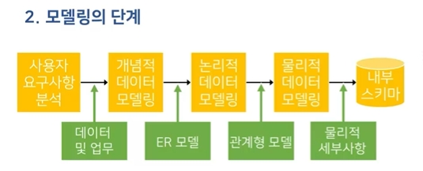

# 데이터베이스시스템 1강 

### 파일 처리 시스템
1. 데이터베이스가 개발되기 전에 데이터 관리에 사용
2. 업무 별 애플리케이션이 개별 데이터를 데이터 파일에 저장,관리하는 시스템
3. 발생 가능한 문제
  - 데이터 종속의 문제
    1. 저장된 데이터가 특정 H/W에서 또는 사용자 및 S/W만 사용될 있도록 제한되는 문제
    - 물리적 데이터 종속
    - 논리적 데이터 종속

  - 데이터 중복의 문제
    1. 동일한 사항에 대한 중복 데이터는 일관성, 보안성, 경제성 측면에서 문제 발생
    - 일관성: 한 사실에 대해 한 개의 데이터 값을 유지
    - 보안성: 같은 데이터에 같은 수준의 보안 유지
    - 경제성: 데이터에 대해 최소한의 저장 공간 만을 점유

  - 무결성 훼손의 문제
    1. 실세계의 데이터는 데이터가 가질 수 있는 가능 범위(제약조건)를 포함
    - 현상에 대한 값의 예:'홍길동'의 수강과목
    - 가능 범위으 예: 1학기 최대 수강과목 18학점
    2. 데이터 무결성
    - 데이터의 정확성 보장
    - 데이터의 값과 값에 대한 제약조건을 동시에 만족
    3. 파일 시스템은 데이터 무결성을 보장하기 위한 기능을 제공하지 않음

  - 동시 접근의 문제 
    1. 동일 데이터에 다수 사용자의 접근 허용 시 일관성이 훼손 

파일 처리 시스템은 데이터 중복을 방지할 수 없으며 이로 인에 데이터의 보안성, 경제성, 일관성 측면에서 문제가 발생한다.

## 데이터베이스의 특징
1. 데이터베이스 시스템의 자기 기술성
- 데이터와 데이터의 정의 및 설명(메타데이터)을 포함
2. 프로그램과 데이터의 격리 및 추상화
- 사용자에게 데이터에 대한 개념적인 표현을 제공하여 접근성을 향상
3. 다중 뷰 제공
- 각 사용자가 관심을 갖는 데이터베이스의 일부만을 표현할 수 있는 기능 제공
4. 데이터 공유와 다수 사용자 트랜잭션 처리
- 다수의 데이터 조작 요청을 동시성 제어 기능을 통해 데이터의 일관성을 보장하면서 동시에 작업을 수행

### 데이터베이스 시스템의 구성
사용자/프로그래머가 DBMS에 

### 값, 데이터, 메타데이터
값: 12
데이터: 2개의 이상의 설명이 붙어야 데이터 **오늘**12**낮 최고기온**
메타데이터: 설명이 붙은게 메타데이터

### DBMS의 3단계 구조
1. 외부 단계 
2. 외부-개념 사상
3. 개념 단계
4. 개념-내부 사상
5. 내부 단계

### 다수 사용자 트랜잭션 처리
1. 트랜잭션의 정의
- 하나의 논리적 작업을 처리하기 위한 일련의 데이터베이스 명령의 집합

### 데이터베이스 언어
1. DBMS는 사용자가 데이터베이스를 쉽게 사용하고 다룰 수 있도록 언어 형태의 인터페이스를 제공
2. 역할에 따라 종류의 언어로 구분
  - 데이터 정의 언어(DDL)
    1. DDL: Data Definition Language
    2. 데이터베이스 객체를 생성, 수정, 삭제하기 위한 언어
    3. DDL의 요구 기능
    - 데이터 모델에 따라 애플리케이션 프로그램이 요구하는 데이터의 논리적 구성이나 특징을 규정
    - 데이터가 기억장치에 저장되도록 데이터의 물리적 구성을 규정
    - 물리적 구성을 논리적 구성으로 변환이 가능하도록 데이터의 물리적 구성과 논리적 구성 간의 사상을 규정

  - 데이터 조작 언어(DML)
    1. DML: Data Manipulation Language
    2. 구조화된 데이터에 사용자가 접근 및 조작할 수 있도록 지원하는 언어(검색, 삽입, 삭제, 수정)
    3. DML의 요구 조건
    - 데이터 조작이 쉽고 간편
    - 데이터 조작 기능이 정확하고 완전
    - 사용자의 요청을 시스템 내부에서 효율적으로 처리 가능 
3. 현대 데이터베이스 언어는 자연어와 유사한 형태의 SQL로 표준화

### 데이터베이스 시스템 아키텍처
1. 중앙집중식 방식
- 단일 서버가 다수의 클라이언트 장치를 대신하여 작동
- 중앙 컴퓨터의 과부하로 전체적인 성능 저하
- 장점: 저렴하게 시스템을 구성 가능
- 단점: 일이 모이면 전체적인 성능 저하
2. 분산 시스템 방식
- 클라이언트 장치의 성능 향상으로 자체적인 처리 능력 보유
- 클라이언트-서버 데이터베이스 시스템
  - 애플리케이션 프로그램의 부하를 분산
  - 소프트웨어의 유지보수 비용을 절감 및 이식성 증가
  
  2계층,3계층 이야기 강의 1시간 보기
### 데이터베이스 관련 용어
1. 데이터(data): 어떠한 사실에 대한 정량적, 정성적 특징을 나타낼 수 있는 값과 값에 대한 설명
2. 데이터베이스(database): 특정 기관의 애플리케이션 시스템에서 사용되는 데이터의 집합
3. 데이터베이스 관리 시스템(DBMS): 데이터베이스에 저장된 데이터의 구성, 저장, 관리, 사용을 위한 소프트웨어 패키지
4. 데이터베이스 시스템(database system): 정보를 데이터베이스에 저장,관리하여 사용자에게 요구된 형태의 정보로 제공하는 컴퓨터 기반 시스템
### 데이터베이스시스템 주요용어
- 파일 처리 시스템
파일을 사용하여 업무에 해당하는 데이터를 관리하는 방식
- 데이터베이스 관리 시스템(DBMS)
정보를 데이터베이스에 저장·관리하여 사용자에게 요구된 형태의 정보로 제공하는 컴퓨터 기반 시스템
- DBMS 3단계 구조
데이터 추상화와 데이터 독립성을 확보하기 위한 개념적-논리적-물리적 3단계 구조
- 트랜잭션
하나의 논리적인 작업을 수행하는 일련의 데이터베이스 명령의 집합

## 1강 문제
1. 다음 중 파일 처리 시스템의 데이터 중복으로 발생할 수 있는 문제가 아닌 것은?
  1. 보안성
  2. 경제성
  3. 통일성
  4. 일관성

* 정답 및 해설:  ③ 번
* 부연설명 : 파일 처리 시스템은 데이터 중복을 방지할 수 없으며 이로 인에 데이터의 보안성, 경제성, 일관성 측면에서 문제가 발생한다.

2. 데이터베이스 3단계 구조에서 논리적 데이터 독립성이 확보되는 과정은?
  1. 개념 단계
  2. 외부 단계
  3. 개념-내부 사상
  4. 외부-개념 사상

* 정답 및 해설: ④ 번
* 부연설명 : DBMS는 데이터의 추상화를 위해 외부-개념-내부 3단계로 구조화되며 외부-개념 사상 과정에서 논리적 데이터 독립성, 개념-내부 사상을 통해 물리적 데이터 독립성이 확보된다.

3. 구조화된 데이터에 사용자가 데이터를 삽입·수정·삭제하고 저장된 데이터를 검색할 수 있도록 지원하는 데이터베이스 언어는?

* 정답 및 해설:  데이터 조작 언어,DML,Data Manipulation Language
* DBMS 인터페이스인 데이터베이스 언어는 데이터 조작 언어와 데이터 정의 언어로 구분되며 이 중 데이터 조작 언어는 데이터 정의 언어로 구조화된 데이터에서 다양한 유형의 데이터 조작을 지원하는 명령어로 구성된다.

# 데이터베이스 2강 ----------------------------------------------------------------------
### 데이터베이스 모델링의 필요
1. 비즈니스적 관점: 어떤 데이터를 저장해야 하는가?
2. 컴퓨터 프로그래머 관점: 어떻게 데이터를 저장해야 하는가?

### 데이터베이스 시스템 구현 과정
1. 사용자 요구사항 분석
2. 개념적 데이터 모델링
3. 논리적 데이터 모델링
4. 개념 스키마
5. 물리적 데이터 모델링
6. 내부 스키마

### 데이터베이스 모델링의 개념
1. 데이터의 의미를 파악하고 데이터와 관여하는 업무 프로세스를 개념적으로 정의하고 분석하는 작업

2. 모델링의 단계

### 데이터 모델
1. 사용할 데이터를 선별하여 데이터베이스에 체계적으로 구조화하여 저장,사용할 방법이 필요

2. 데이터 모델
  - 의미, 데이터 타입, 연산 등을 명시하기 위해 사용할 수 있는 개념들의 집합

3. 데이터 모델링
  - 실세계의 일부분을 DBMS가 지원하는 데이터 모델의 형태로 나타내는 과정

### 데이터베이스 모델링의 단계
1. 개념적 데이터 모델링
  - 요구사항의 해석 오류를 방지
  - 실세계의 데이터를 개념적으로 일반화시켜 데이터 구조, 데이터 타입, 속성, 관계, 제약조건 등을 이끌어내는 과정

2. 논리적 데이터 모델링
  - 특정 DBMS의 구현 모델에 맞춰 데이터를 표현하는 과정
  - 데이터 정의 언어로 기술된 개념 스키마 생성

3. 물리적 데이터 모델링
  - 데이터베이스 파일의 내부 저장구조, 파일 구성, 인덱스, 접근 경로 등을 결정하는 과정

### 사용자 요구사항 분석
1. 데이터에 대한 충분한 사전 분석없이 적절한 설계가 불가능

2. 사용자의 요구를 명세하지 않고 데이터베이스 설계 및 개발을 진행하는 경우

### 사용자 요구사항 분석의 개념
1. 시스템의 대상이 되는 업무를 분석
  - 정보 시스템의 데이터베이스가 신속하고 효과적으로 업무 처리를 지원
2. 도출, 분석, 기록 단계로 수행
  - 국제 표준화: IEEE-Std-830

### 사용자 요구사항 분석 과정
1. 제안요청서 -> 요구사항 도출
  - 요구사항 도출
    - 구축대상, 프로젝트 목표, 범위를 기준으로 조사범위를 결정
    - 업무관계자 인터뷰
    - 외부자료 수집 및 분석

2. 요구사항 명세서 -> 요구사항 분석
  - 요구사항 분석
    - 도출된 요구사항의 명확성, 완전성, 모호성 검증
    - 불완전한 부분이 존재할 경우 요구사항 도출단계 재수행
    - 요구사항을 분류하여 통합 또는 분리

3. 요구사항 정의서 -> 요구사항 기록
  - 요구사항 기록
    - 요구사항 목록 정리 및 관리자의 승인
    - 정리된 요구사항을 형식에 맞춰 문서화
    - 프로젝트 종료 때까지 반영 여부 지속적 관리

- 요구사항 도출->요구사항 분석->요구사항 기록
### ER 모델의 개념
1. 1976년 카네기 멜론 대학의 P.Chen 박사 제안
2. 실세계의 속성들로 이루어진 개체(entity)와 개체 사이의 관계(relationship)를 정형화시킨 모델
3. 개념적 모델링 단계에서 사용되는 데이터 모델
4. 데이터 구조와 관계를 ER 다이어그램(ERD)으로 표현
5. 구성요소
  - 개체 집합
  - 관계 집합
  - 속성

### 개체 집합
- 개체(entity)
  - 실세계에 존재하는 다른 객체와 구별되는 유무형의 사물
  - 개체를 설명하는 여러 속성들로 구성
- 개체 집합(entity set)
  - 같은 속성을 공유하는 개체들의 모임

### 관계 집합
- 관계
  - 개체와 개체 사이의 연관성
- 관계 집합
  - 개체 집합 간의 연결관계
  - 마름모로 표현

### 속성
1. 개체를 구체적으로 설명
2. 속성에 포함될 수 있는 값의 특성에 따라 여러 종류로 구분
3. 속성의 종류
  - 단순 속성과 복합 속성
  - 단일값 속성과 다중값 속성
  - 유도 속성과 저장 속성

1. 단순 속성: 더 작은 구성요소로 나눌 수 없는 속성
2. 복합 속성: 더 작은 구성요소로 나눌 수 있는 속성(들여쓰기가 되야함)

1. 단일값 속성: 한 개체에 대해 단 하나의 값만을 갖는 속성
2. 다중값 속성: 한 개체에 대해 여러 개의 값을 갖는 속성

1. 유도 속성: 다른 속성의 값으로부터 값이 유추될 수 있는 속성(생년월일 적으면 나이를 알수있음)
2. 저장 속성: 유도 속성을 위해 사용될 수 있는 속성

### 제약조건
1. 데이터 모델은 데이터, 의미, 구조, 연관성 및 데이터의 조건을 표현하기 위한 도구

2. ER 모델은 개체와 관계에 대한 표현의 정확성을 위해 데이터가 준수해야 하는 제약조건을 정의할 수 있는 표현 방법을 제공

3. 제약조건(constraints)의 종류
  - 사상수
  - 참가 제약조건
  - 키 속성
  
- 사상수
  1. 관계 집합에 참가한 개체 집합에 대해 한 개체가 다른 개체와 관계를 맺을 수 있는 수량을 명시
  일대일(1:1),일대다(1:N),다대일(N:1),다대다(N:N)
  - 화살표로 표시

- 참가 제약조건
  1. 전체적 참가: 어떤 개체 집합의 모든 개체가 관계 집합에 참여하는 조건
  2. 부분적 참가: 어떤 개체 집합의 일부 개체가 관계 집합에 참여 하는 조건
  - 두줄로 표시

- 키(key)속성
  1. 각 개체를 구별하는데 사용되는 유일한 값을 가지는 속성의 집합
    - 개체를 고유하게 구분하는 역할
    - 관계 집합의 특정 관계를 찾는 역할
    - 밑줄을 그어서 표시

- 특수 속성과 특수 관계
  1. 관계 집합의 속성: 두 개체 집합의 관계에서 생성되는 값을 저장하는 속성
  2. 재귀적 관계: 한 개체 집합이 자기 자신과 관계 집합을 형성하는 관계

- 특수 관계
  1. 약한 개체 집합: 개체의 존재 유무가 관계를 맺고 있는 개체의 존재에 종속되는 개체 집합(예:학생이 이민가면 학교 개인계좌 삭제)
  2. 강한 개체 집합: 약한 개체 집합과 연결되는 일반 개체 집합

# 데이터베이스 3강

### 논리적 데이터 모델링 단계
1. DBMS에서 사용하는 데이터 모델에 맞추어 데이터를 표현하는 과정

2. 데이터 정의 언어로 기술된 개념 스키마 생성

3. 관계형 모델(relational model)
  - 1969년 에드가 F. 코드에 의해 제안
  - 릴레이션(relation)으로 데이터를 표현하는 모델
  - 현재 대다수 DBMS의 기초
  (오라클,MySQL,MSSQL 등)

### 릴레이션의 구성
- 릴레이션은 표
- 스키마
- 레코드, 투플은 내용
- 세로의 한줄(열)은 컬럼,속성,필드
- 릴레이션,레코드(투플),컬럼(속성,필드),스키마,인스턴스,컬럼값

### 릴레이션의 특징
1. 레코드의 유일성: 중복된 레코드의 존재가 불가능
2. 레코드의 무순서성: 레코드의 순서는 의미가 없음
3. 컬럼의 무순서성: 컬럼은 순서가 없고, 이름과 값의 쌍
4. 컬럼값의 원자성: 모든 값들은 나눌 수 없는, 단 하나의 의미

### 관계형 모델의 개념
- 릴레이션의 특성
  1. 레코드의 유일성: 중복된 레코드의 존재가 불가능
  2. 레코드의 무순서성: 레코드의 순서는 의미가 없음
  3. 컬럼의 무순서성: 컬럼은 순서가 없고, 이름과 값의 쌍
  4. 컬럼값의 원자성: 모든 값들은 나눌 수 없는, 단 하나의 의
- 키의 역할
  1. 릴레이션의 레코드를 유일하게 식별하는 값
- 키의 종류 및 속성
  1. 키의 속성
    - 유일성(Uniqueness)
    - 최소성(Irreducibilty)
  2. 키의 종류
    - 수퍼키(super key): 유일성 만족
    - 후보키(candidate key): 유일성, 최소성 만족
    - 기본키(PK: primary key): 레코드의 구분을 위해 선택된 후보키
    - 외래키(FK: foreign key): 참조된 다른 릴레이션의 기본키

- 관계형 모델의 예
  1. 수퍼키: 학과이름, {학과이름, 단과대학}, 주소, 전화번호, {전화번호, 졸업학점} 등

  2. 후보키: 학과이름, 주소, 전화번호

  3. 기본키: 학과이름

### 관계형 모델의 제약조건
1. 영역 제약 조건: 컬럼에 정의된 영역(domain)에 속한 값으로만 컬럼값이 결정

2. 키 제약조건: 키는 레코드를 고유하게 구별하는 값으로 구성

3. 개체 무결성 제약조건: 어떠한 기본키 값도 널(null)이 될수 없음

4. 참조 무결성 제약조건: 반드시 존재하는 레코드의 기본키만 참조 가능

### 널(NULL)의 개념
- '없음'또는 '0'이 아닌 미지의 값에 대한 표현
  - 입력된 적이 없는 값
  - 적용 불가능한 값

### ERD의 변환

### 논리적 데이터 모델링
1. DBMS의 구현 모델에 맟춰 데이터를 표현하는 과정
2. 데이터 정의 언어로 기술된 개념 스키마 생성
3. 논리적 데이터 모델링의 필요
  - 관계형 DBMS(RDBMS)의 구현 모델에 맞춰 데이터의 구조와 관계를 표현
  - 작성된 ERD를 RDBMS가 수용 가능하는 구조로 변환

### ER 다이어그램 변환 규칙

### 데이터 연산
### 관계 연산의 개념
1. 관계형 모델을 기반으로 구성된 릴레이션을 사용하여 새로운 릴레이션을 생성하는 표현

2. 사용자의 관점에서 필요한 데이터를 릴레이션에서 추출하는 방법을 제공하는 도구

3. 관계 대수(relational algebra)
  - 관계 연산을 정의하는 방법
  - 주어진 릴레이션에서 필요한 릴레이션을 만드는 연산자로 구성
  - 관계 대수 연산자는 새로운 임시 릴레이션을 생성
  - 연산자를 중첩하여 연산 처리 절차를 표현

### 셀렉트 연산
1. 주어진 릴레이션에서 조건을 만족하는 레코드를 갖는 릴레이션을 생성

### 프로젝트 연산
1. 기술된 컬럼만 갖는 릴레이션으로 재구성

### 집합 연산자
1. 수학적 집합 이론에서의 이진 연산
  - 합집합
  - 교집합
  - 차집합

2. 릴레이션은 집합, 레코드는 집합에 포함된 원소

3. 집합 연산자 사용 조건
  - 릴레이션 R과 S의 차수가 동일
  - 모든 i에 대해 R의 i번째 컬럼의 도메인과 S의 i번째 컬럼의 도메인이 반드시 동일

### 카티시언 프로덕트 연산
- 두 릴레이션에 포함된 레코드 간의 모든 조합을 생성하는 이항 연산자
    R x S 

### 조인 연산
- 두 릴레이션에서 조건을 만족하는 레코드를 결합한 레코드로 구성된 릴레이션을 생성

카티시언 프로덕트와 셀렉트를 결합으로 내부로 중요함

### 집계 함수 연산
- 레코드 그룹화를 위해 집계 함수 연산자 앞에 그룹화 속성을 기술