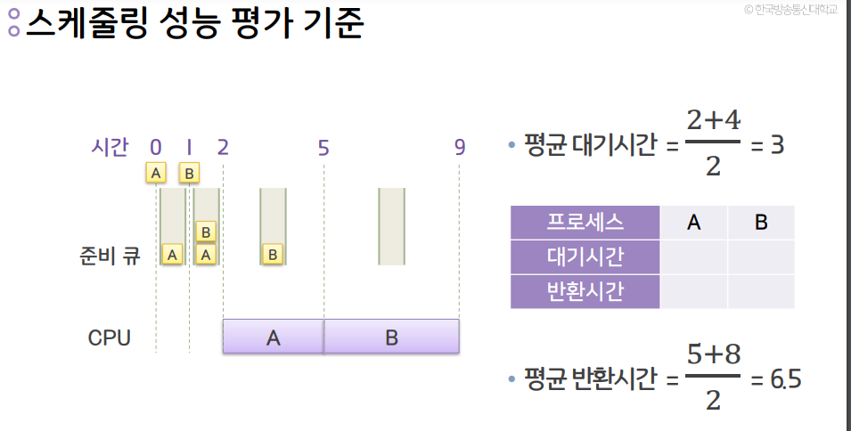
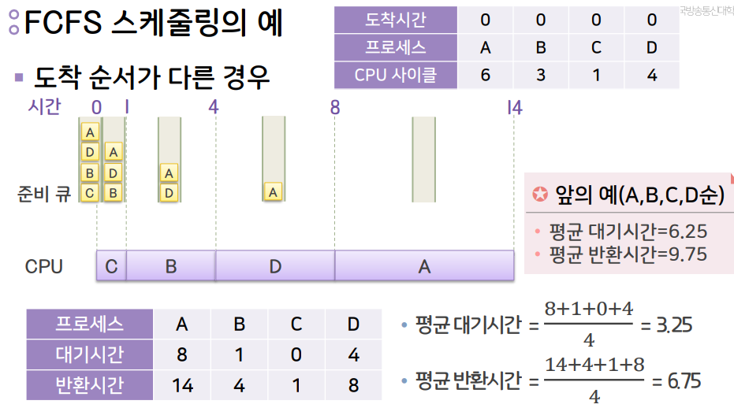
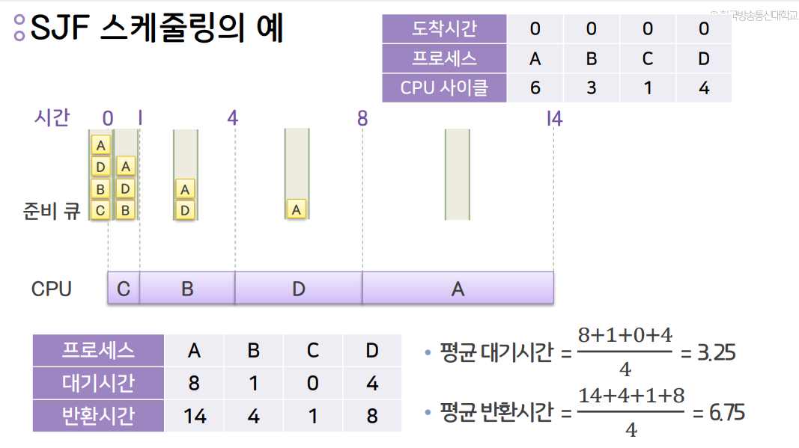
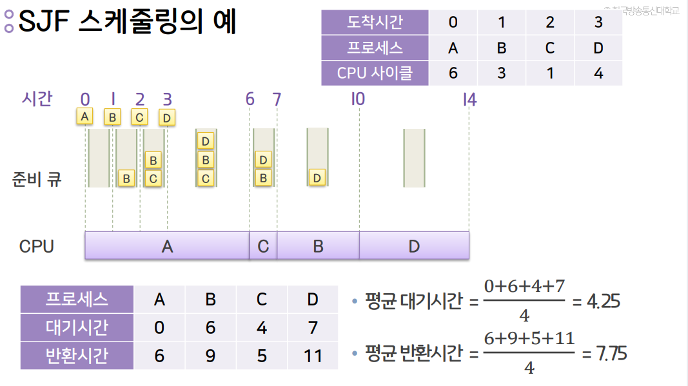

# 운영체제 1강

### 운영체제의 역할
- 컴퓨터 시스템의 운영
1. 컴퓨터시스템의 자원을 제어 및 관리
2. 응용프로그램들의 실행을 도와주는 소프트웨어
- 사용자 지원
1. 사용자의 명령을 해석하여 실행
2. 사용자와 하드웨어 사이의 매개체 역할수행

### 컴퓨터 시스템과 운영체제
- 운영체제가 하드웨어와 응용 프로그램 사이에 위치

## CPU의 동작 모드
#### 슈퍼바이저 모드(커널 모드)
- 운영체제의 커널이 동작되는 모드
- 하드웨어를 직접 제어할 수 있는 **CPU 명령어 사용 가능**
#### 보호 모드(사용자 모드)
- 응용 프로그램이 동작되는 모드
- 하드웨어를 직접 제어할 수 있는 **CPU 명령어 사용 불가능**
#### 시스템 호출
- 응용 프로그램이 운영체제에게 서비스를 요청하는 메커니즘
- 시스템호출 -> 보호모드에서 슈퍼바이저 모드로 변경 -> 커널 동작 -> 하드웨어 제어 

### 커널 
- 운영체제의 핵심요소
- 응용프로그램과 하드웨어 수준의 처리 사이의 가교 역할

- 대표적인 구성 방식: 일체형 커널, 마이크로 커널 

- 일체형 커널
- 운영체제의 모든 서비스가 커널 내에 포함됨
- 장점: 커널 내부 요소들이 서로 효율적으로 상호작용을 할 수 있음
- 단점: 한 요소에 있는 오류로 인해 시스템 전체에 장애가 발생할 수 있음
- 예: UNIX, Linux 운영체제들

- 마이크로 커널
- 운영체제의 대부분의 요소들을 커널 외부로 분리
- 커널 내에는 메모리 관리, 멀티태스킹, 프로세스 간 통신(IPC) 등 최소한의 요소들만 남김
- 장점: 새로운 서비스를 추가하여 운영체제를 확장하기 쉬움, 유지보수가 용이하며 안정성이 우수함
- 단점: 커널 외부 요소들 사이는 IPC를 통해야만 하므로 성능 저하가 발생

## 운영체제의 구성
- 컴퓨터 시스템의 자원의 성격에 따라 구분
#### 프로세스 관리자
- 프로세스를 생성, 삭제, CPU 할당을 위한 스케쥴 결정
#### 메모리 관리자
- 메모리(주기억장치)공간에 대한 요구의 유효성 체크
- 메모리 할당 및 회수
- 메모리 공간 보호
#### 장치 관리자
- 컴퓨터 시스템의 모든 장치를 관리
- 시스템의 장치를 할당, 작동 시작, 반환
- 예: 비디오 디스플레이, 키보드 ,프린터,디스크 드라이브 네트워크 장치 등
#### 파일 관리자
- 컴퓨터 시스템의 모든 파일을 관리
- 파일의 접근 제한 관리
- 파일을 열어 자원을 할당하거나 파일을 닫아 자원을 회수
- 예:컴파일러, 응용 프로그램, 데이터 파일 등 

## 운영체제의 유형
- 응답시간의 속도, 데이터 입력의 방식에 따라 분류
#### 일괄처리 운영체제
- 작업을 모아서 처리
- 사용자와 상호작용 없이 순차적으로 실행
- 효율성 평가: 처리량, 반환시간
- 처리량: 주어진 시간 안에 처리된 작업의 수
- 반환시간: 작업의 생성 시점부터 종료 시점까지의 소요시간
- 예: OMR 
#### 대화형 운영체제
- 시분할 운영체제라고도 함
- 일괄처리 운영체제보다 빠르지만 실시간 운영체제보다는 느린 응답시간
- 응답시간: 요청한 시점부터 반응이 시작되는 시점까지의 소요시간
- 이용자에게 즉각적인 피드백을 제공
#### 실시간(real-time) 운영체제(RTOS라고도 함)
- 가장 빠른 응답시간
- 처리의 결과가 현재의 결정에 영향을 주는 환경에서 사용
- 우주선 비행 시스템, 미사일 제어, 증권거래 관리 시스템, 은행 입출금 시스템 등에 사용
#### 하이브리드 운영체제
- 일괄처리 운영체제와 대화형 운영체제의 결합
- 이용자는 터미널을 통해 접속하고 빠른 응답시간을 얻음
- 대화형 작업이 많지 않을 경우 백그라운드에서 배치 프로그램 실행
- 현재 사용되고 있는 대부분의 대형 컴퓨터 시스템은 하이브리드 운영체제 

## 운영체제 역사
#### 1940년대: 초기 전자식 디지털 컴퓨터
- 운영체제가 존재하지 않음
- 기계적 스위치에 의해 작동
#### 1950년대: 단순 순차처리 및 단일흐름 일괄처리
- 한 번에 오직 하나의 작업만을 수행 
- 최초의 운영체제 등장(IBM 7이용)
#### 1960년대: 멀티프로그래밍
- 멀티프로그래밍, 시분할 처리 개념
- 다중 대화식 사용자 지원
#### 1970년대: 멀티모드 시분할
- 일괄처리, 시분할 처리, 실시간 처리를 지원하는 멀티모드 시분할의 보편화
- 근거리 지역 네트워크(LAN)의 실용화 
- 정보보호 및 보안문제의 증대로 **암호화의 중요성 대두**
#### 1980년대: 분산 네트워크
- 운영체제 기능이 하드웨어 자체에 포함된 펌웨어 개념의 대두
- 2개 이상의 프로세서를 이용하는 멀티프로세서 환경
- 네트워크의 대두와 함께 클라이언트/서버 모델 확산
#### 1990년대: 병렬처리 및 분산처리
- 순차처리를 벗어나 분산 및 병렬 처리 발전
- 그래픽 사용자 인터페이스(GUI)의 강화
- 선점형 멀티태스킹, 멀티쓰레딩, 가상 메모리의 보편화
#### 2000년대 이후: 모바일 및 임베디드 운영체제
- 시스템은 고속화, 고기능화, 경량화 방향으로 발전
- 다양한 통신망의 확대와 개방형 시스템의 발달
- 운영체제는 다양한 기능 지원, 확장성과 호환성 극대화, 사용자 편의성 높임
- 네트워크 기반의 분산 및 병렬 운영체제의 보편화
- 클라우드 환경의 운영체제
- 64비트 CPU에 호환되는 64비트용 운영체제
- PDA, PMP, 스마트폰, 태블릿 등의 모바일 장치 대중화로 모바일 운영체제 보편화
- 가전제품을 위한 임베디드 운영체제의 보편화

# 운영체제 정리하기
- 운영체제는 컴퓨터 시스템의 자원을 관리하고 컴퓨터 프로그램이 동작하기 위한 서비스를 제공하는 시스템 소프트웨어이다.

- 응용 프로그램은 하드웨어 자원을 직접 액세스할 수 없으며, 시스템 호출이라는 절차를 통해 필요한 서비스를 운영체제에게 요청하여야 한다.

- 커널은 응용 프로그램과 하드웨어 수준의 처리 사이의 가교 역할을 하는 운영체제의 핵심 요소로, 대표적인 두 가지로 일체형 커널과 마이크로 커널이 있다.

- 운영체제의 주요 구성 요소에는 프로세스 관리자, 메모리 관리자, 장치 관리자, 파일 관리자가 있다.

- 운영체제의 유형은 크게 일괄처리 운영체제, 대화형 운영체제, 실시간 운영체제, 그리고 하이브리드 운영체제로 분류된다.

# 운영체제 2강

### 프로세스
- 프로세스(process):실행 중인 프로그램
  - 프로그램: 동작을 하지 않는 정적,수동적 개체
  - 프로세스: 동작을 하는 능동적 개체

- 운영체제로부터 자원을 할당 받아 동작
  - 자원: CPU, 메모리, 입출력장치, 파일 등
  - 동작: CPU가 프로세스의 명령을 실행

- 사용자 및 시스템 프로세스 존재

### 프로세스와 운영체제
- 프로세스 관리자의 역할
  - 프로세스를 생성 및 삭제
  - 프로세스 실행(CPU 할당)을 위한 스케줄 결정
  - 프로세스의 상태를 관리하며 상태 전이를 처리

### 프로세스의 상태
- 5-상태 모델
  - 생성: 처음 작업이 시스템에 주어진 상태
  - 준비: 실행 준비가 되어 CPU 할당을 기다리는 상태
  - 실행: 프로세스가 처리되는 상태
  - 대기: 프로세스가 특정 자원을 할당받을 때까지 또는 I/O작업이 끝날 때까지 작업이 보류되는 상태
  - 종료: 모든 처리가 완료되어 사용자에게 반환되는 상태

  - 준비 -> 실행 디스패치
  - 실행 -> 준비 할당시간 만료
  - 실행 -> 대기 이벤트 대기
  - 대기 -> 준비 재개 조건 만족

- 프로세스 제어 블록(PCB)
  - 프로세스 제어 블록(PCB)
    - 프로세스의 관리를 위한 목적
    - 프로세스의 정보를 보관
    - 각 프로세스마다 존재
    - 프로세스가 진행함에 따라 내용 변경 

### 프로세스의 생성과 종료
* 프로세스 생성 작업
  - 프로세스의 이름(번호, PID)결정
  - 준비 큐에 삽입
  - 초기 우선순위 부여
  - 프로세스 제어 블록(PCB)생성 등

* 프로세스 생성 방법: 시스템 호출
- 프로세스 생성 시스템 호출
  - 하나의 프로세스가 프로세스 생성 시스템 호출을 통해 새로운 프로세스를 생성 예:fork()
  - 호출하는 프로세스: 부모 프로세스
  - 생성되는 프로세스: 자식 프로세스

* 시스템 프로세스와 사용자 프로세스 모두 부모 프로세스 가능

* 생성되는 프로세스의 자원
  - 운영체제로부터 직접 얻는 경우
  - 부모 프로세스 자원의 일부를 얻는 경우

* 자식 프로세스의 자원은 부모 프로세스의 자원으로 제한
  - 과도한 자식 프로세스 생성에 따른 시스템 과부하 방지

* 프로세스 종료
  - 프로세스의 마지막 명령이 실행을 마치는 경우
  - 프로세스 종료 시스템 호출(예: exit())을 통하는 경우
  - 프로세스 종료 후 부모 프로세스에게 실행결과를 되돌려 줌

* 프로세스 종료 시스템 호출
  - 부모에 의해서만 호출
  - 자식 프로세스가 할당된 자원의 사용을 초과할 때 혹은 더 이상 필요치 않을 때

### 프로세스 간의 관계
|   |독립적 프로세스|유기적 프로세스|
|---|---|---|
|의미|다른 프로세스의 영향을 받지도 않고 주지도 않음|다른 프로세스와 영향을 주고받음|
|프로세스 상태|다른 프로세스와 공유하지 않음|다른 프로세스와 공유함|
|실행|다른 프로세스와 무관하게 중단 및 재시작 가능|   |
|실행|결정적, 재생 가능|비결정적, 재생 불가능|
|데이터|다른 프로세스와 공유하지 않음|다른 프로세스와 공유함|

### 프로세스와 쓰레드
* 전통적인 프로세스
  - 처리의 기본 단위
  - 자원 소유의 단위(하나의 주소공간)및 디스패칭의 단위(하나의 제어흐름)
  - 단일 프로세스 내에서 동시처리 불가능
  - 동시처리 불가능해서 **쓰레드 등장**

* 쓰레드(Thread)
  - 프로세스 내에서의 다중처리를 위해 제안된 개념
  - 하나의 프로세스 내에는 하나 이상의 쓰레드가 존재
  - 하나의 쓰레드 내에서는 하나의 실행점만 존재(**디스패칭의 단위**)
  - 실행에 필요한 최소한의 정보만을 가지며, 자신이 속해 있는 프로세스의 실행환경을 공유

* 다중 쓰레드의 장점
  - 멀티CPU 혹은 멀티코어 시스템에서는 병렬처리 가능
  - 처리 속도 별로 쓰레드가 나눠진 경우 효율적인 처리 가능

### 스케줄링 단계
* 상위 단계 스케줄링
  - 시스템에 들어오는 작업들을 선택하여 프로세스를 생성한 후 프로세스 준비 큐에 전달
  - 선택 기준: 시스템의 자원을 효율적으로 이용할 수 있도록 하는 것
  - 입출력(I/O) 중심 작업과 연산 중심 작업을 균형있게 선택

* 하위단계 스케줄링
  - 사용 가능한 CPU를 준비상태의 어느 프로세스에게 배당할지를 결정
  - CPU를 배당받은 프로세스는 결국 실행상태가 되어 프로세스가 처리됨
  - 수행 주체: 디스패처(dispatcher)

* 중간 단계 스케줄링
  - 프로세스를 일시적으로 메모리에서 제거하여 중지시키거나 다시 활성화 시킴
  - 시스템에 대한 단기적인 부하를 조절

### 스케줄링 정책
* 스케줄링 기본 목표
  - 공정성: 모든 프로세스가 적정 수준에서 CPU 작업을 할 수 있게 함
  - 균형: 시스템의 자원들이 충분히 활용될 수 있게 함
  - 예시
  1. 일괄처리 운영체제:처리량의 극대화, 반환시간의 최소화, CPU활용의 극대화
  2. 대화형 운영체제:빠른 응답시간, 과다 대기시간 방지
  3. 실시간 운영체제:처리 기한을 맞춤

* 선점(Preemptive) 스케줄링 정책
  - 진행 중인 프로세스에 인터럽트를 걸고 다른 프로세스에 CPU를 할당하는 스케줄링 전략
  - 높은 우선순위의 프로세스를 긴급하게 처리하는 경우에 유용
  - 대화식 시분할 시스템에서 빠른 응답시간을 유지하는데 유용
  - 문맥 교환에 따른 오버헤드 발생
  - 문맥이란:CPU의 모든 레지스터와 기타 운영체제에 따라 요구되는 프로세스의 상태
  - 문맥교환이란:CPU의 현재 실행하고 있는 프로세스의 문맥을 PCB에 저장하고 다음 프로세스의 PCB로부터 문맥을 복원하는 작업

* 비선점(Nonpreemptive)스케줄링 정책
  - 프로세스가 CPU를 할당받아 실행이 시작되면 작업 자체가 I/O 인터럽트를 걸거나 작업을 종료할 때까지 실행상태에 있게 됨
  - 모든 프로세스가 공정하게 순서에 따라 실행됨 -> 응답시간 예측 가능
  - 짧은 프로세스가 긴 프로세스를 기다리게 될 수 있음

# 정리하기
- 프로세스는 실행 중인 프로그램을 의미하며, CPU, 메모리, 입출력장치, 파일 등 실행에 필요한 자원이 할당된다.

- 프로세스는 생성, 준비, 실행, 대기, 종료의 다섯 상태 중 하나로 존재하며, CPU의 스케줄링, I/O 대기 등에 따라 준비, 실행, 대기 등으로 상태가 변화되며 동작한다.

- 프로세스 제어 블록(PCB)은 프로세스를 명시해 주는 다양한 내용을 포함하고 있다.

- 쓰레드란 하나의 프로그램 내에서 제어의 단일 순차적 흐름으로 정의되며, 하나의 쓰레드 내에서는 하나의 실행점만이 존재하며, 각 쓰레드는 수행에 필요한 최소한의 정보만으로 구성된다.

- 하나의 프로세스 내에는 하나 이상의 쓰레드가 있을 수 있어 쓰레드를 생성하여 프로세스 내에서 다중처리를 할 수 있다.

- 프로세스의 스케줄링을 위해 상위단계, 하위단계 및 중간단계 스케줄러가 사용된다.

- 스케줄링 기법 중 어떤 프로세스도 CPU를 빼앗길 수 없는 경우를 비선점이라 하며, 그렇지 않으면 선점이라고 한다.

# 운영체제 3강

### 1. 스케줄링 성능 평가 기준
- 평균 대기시간: 각 프로세스가 수행이 완료될 때까지 
**준비 큐에서 기다리는 시간의 합의 평균값**
- 평균 반환시간: 각 프로세스가 생성된 시점부터 수행이 
**완료된 시점까지의 소요시간의 평균값**

- 스케줄링 성능 평가 기준

### 2. 다양한 스케줄링 알고리즘
- 프로세스와 쓰레드

  - FCFS(First-Come First-Served) 스케줄링
    - 비선점 스케줄링 알고리즘
    - 준비 큐에 도착한 순서에 따라 디스패치
    - 장점: 가장 간단한 스케줄링 기법
    - 단점: 
    1. 짧은 프로세스가 긴 프로세스를 기다리거나,
    중요한 프로세스가 나중에 수행될 수 있음
    2. 프로세스들의 도착 순서에 따라 평균 반환시간이 크게 변함
    
    - FCFS 스케줄링의 예
    

    - FCFS 스케줄링의 도착 순서가 다른 경우(FCFS 단점)
    
     
  - SJF(Shortest Job First) 스케줄링 
    - 비선점 스케줄링 알고리즘
    - 준비 큐에서 기다리는 프로세스 중 실행시간이 가장 짧다고 예상된 것을 먼저 디스패치
    - 장점: 일괄처리 환경에서 구현하기 쉬움
    - 단점: 실행 예정 시간 길이를 사용자의 **추정치에 의존**하기 때문에 실제로는 먼저 처리할 작업의 CPU 시간을 예상할 수 없음

    - SJF 스케줄링 예
    

    - SJF 스케줄링 도착 순서가 다른 경우
    

  - SRT(Shortest Remaining Time) 스케줄링
    - 선점 스케줄링 알고리즘
    - 실행이 끝날 때까지 남은 시간 추정치가 가장 짧은 프로세스를 먼저 디스패치
    - 장점
      - SJF보다 평균 대기시간이나 평균 반환시간에서 효율적
      - 대화형 운영체제에 유용
    - 단점
      - 각 프로세스의 실행시간 추적, 선점을 위한 문맥 교환 등 SJF보다 오버헤드가 큼

  - RR 스케줄링
  - HRN 스케줄링
  - 다단계 피드백 큐 스케줄링
### 스케줄링 알고리즘 
