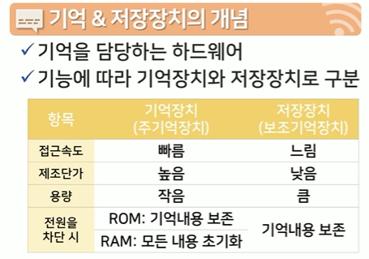

# 인터넷과 정보사회 1강

### 데이터
- 데이터의 개념: 어떤 현상이나 사실에 대한 설명 또는 설명의 집합
- 질적 데이터:붉다,밝다,뜨겁다 등, 형용사
- 양적 데이터:3500도, 수치
- 데이터란 관찰이나 측정을 통해 얻은 수치, 문자와 같은 변할 수 있는 질적 또는 양적 값을 뜻한다.

### 인터넷과 정보사회 주요용어
- 질적 데이터: 대상물에 대해 사람이 평가하여 평가 결과를 사람이 사용하는 문자의 형태로 표현하고 이를 기록한 결과물

- 양적 데이터: 길이, 무게, 개수 등의 특정 측정 기준에 맞춰 대상물을 측정하고 이 결과를 숫자의 형태로 표현한 결과물

- 연속적 데이터: 데이터가 척도(값의 범위)의 특정 수치의 값으로 나타내어지는 데이터

- 범주적 데이터: 데이터가 특정 범위 또는 그룹에 포함되어 나타내어지는 데이터

## 정리하기
- 데이터란 관찰이나 측정을 통해 얻은 수치, 문자와 같은 변할 수 있는 질적 또는 양적 값을 뜻한다.

- 데이터는 형태에 따라 문자를 의미하는 텍스트, 수치를 나타내는 숫자, 음성, 이미지, 동영상과 같은 멀티미디어 데이터로 구분된다.

- 정보란 데이터를 처리하여 실제 문제해결에 도움이 될 수 데이터를 정리한 결과물을 뜻한다. 데이터 처리에는 정렬, 합산, 군집화 등의 작업이 동반된다.

- 데이터는 기록할 만한 가치가 있는 대상이지만, 데이터를 사용하려는 사람에게 직접적은 도움을 주지 못하는 반면, 정보는 문제를 해결하는데 직접적인 도움을 줄 수 있다.

- 데이터는 현상으로부터 관찰 및 측정을 통해 얻어지며 정보는 데이터를 처리 및 가공하여 추출된다.

- 기말고사 시험을 통해 학업 성취도 정보를 얻기 위한 과정을 예로 들면, 기말고사 답안지를 채점하여 기말고사 성적 데이터를 얻을 수 있으며, 성적 데이터를 정렬하여 등수를 매겨 학업 성취도 정보를 추출할 수 있다.

- 데이터와 정보의 상위에는 지식과 지혜가 있다. 지식은 어떤 정보가 주어진 문제(질문)에 답이될 수 있는지 찾아낼 수 있는 것에 대한 정보이며, 지혜는 관련이 없는 정보 사이의 연관성을 새롭게 찾아 낼 수 있는 지식의 상태를 의미한다.

# 인터넷과 정보사회 2강
- 컴퓨터는 입력된 데이터를 자동으로 처리하여 정보로 생산하는 기계
### 컴퓨터의 발전과정
1. 1세대 컴퓨터: 진공관 사용(진공관은 전구랑 비슷 차이는 스위치 유무)
- 1942년에 개발된 **ABC(어태너소프-베리 컴퓨터)가 세계 최초의 컴퓨터**
- 수백~수만개 단위의 진공관으로 2진 연산
- 높은 발열,잦은 고장으로 인한 진공관 교체로 불편
- 수명이 진공관마다 다르다는게 문제 280여개 진공관

2. 2세대 컴퓨터: 트랜지스터(진공관보다 크기가 작음)
- **TRADIC 2세대 트랜지스터 사용한 최초의 컴퓨터(800여개의 트랜지스터 사용)** 
- 트랜지스터가 진공관을 대체하여 컴퓨터의 소형화가 가능
- 트랜지스터를 이용한 연산소자로 컴퓨터의 신뢰도와 성능이 비약적으로 향상

3. 3세대 컴퓨터: 집적회로(IC)
- **애플 매킨토시 집적회로를 이용한 최초의 컴퓨터** 
- 수백개의 트랜지스터를 하나의 칩으로 집적하여 소형화, PC의 등장
- 운영체제(OS)의 개념이 도입

4. 4세대 컴퓨터: 고밀도 IC
- 범용 PC
- 하나의 실리콘 조각에 수만~수억개의 회로를 집적
- 집적 기술의 향상으로 마이크로프로세서 개념이 도입

### 컴퓨터의 종류
1. 개인용 컴퓨터(Personal Computer PC)
- 기업이나 가정에서 개인이 사용하는 컴퓨터
- 여러 종류의 디지털 정보의 저장, 관리, 통신 작업을 수행
- 스마트폰은 일반컴퓨터에 전화기능을 탑재하여 휴대성을 높인 장치

2. 메인프레임 컴퓨터
- 중앙집중방식
- 통계나 금융관련 전산업무와 같은 복잡한 작업과 다수 사용자를 요구하는 분야에 사용
- 터미널을 통해 입력과 출력만을 담당

3. 슈퍼컴퓨터
- 기상,물리,천문 시뮬레이션과 같은 대용량 계산이 필요한 분야에 사용
- 페타플롭스(1초에 1경번 부동소수점 계산)단위 연산을 수행(일반 PC는 약 0.0015페타플롭스)

### 디지털 컴퓨터
- 현재 우리가 사용하고 있는 대다수의 컴퓨터는 디지털 방식으로 구동되는 디지털 컴퓨터(양적 데이터를 취급)
#### 디지털 데이터의 기본 단위
- 비트(bit):컴퓨터에서 사용하는 가장 작은 정보 단위, 0과 1만 구분
- 바이트(byte):컴퓨터에서 문자를 나타내는 가장 작은 단위 8개 비트가 모여서 만들어짐

### 디지털과 아날로그
- 아날로그(analog):사물이나 개념을 연속적인 물리량 값으로 표현, 질적 데이터 또는 양적 데이터로 표현
- 아날로그는 정확한 값을 전달하는 데에 한계가 있다
- 정확한 계산을 수행할 때 디지털 사용
- 디지털(digital):사물이나 개념을 이산적인 값으로 근사하여 표현, 양적 데이터로 표현(수치)

### 데이터 크기와 표현
- 데이터 크기와 디지털 데이터의 표현 능력은 비례 

### 숫자 데이터와 문자 데이터
- 숫자 데이터의 표현: 진법 변환 
- 문자 데이터의 표현: 인코딩 체계(가장 최초의 인코딩 체계 ASCII코드)
- 아스키 코드표(아메리칸 스탠다드)
- **패리티 비트**찾아보기

### 프로그램의 이해
- 컴퓨터는 어떠한 데이터 처리를 위한 처리 방법과 과정을 자의적으로 결정이 불가능
- 처리 방법과 과정이 정의된 프로그램을 사용
- 프로그램이란 컴퓨터가 어떠한 작업을 자동으로 처리할 수 있도록 처리 방법 및 순서를 컴퓨터가 이해할 수 있는 언어 형태로 기술한 것
- 유사한 유형의 여러 문제를 추상화시킨 알고리즘을 구현

#### 알고리즘
- 해당 문제와 유사한 여러 문제를 처리할 수 있도록 하는 절차, 알고리즘(Algorithm)
- **알고리즘 정의:** 문제를 풀기 위한 단계별 절차를 수학적 또는 체계적 명령의 형태로 기술한 것, 주어진 명령어를 처리하는 컴퓨터에게 문제를 해결하도록 만드는 정형화된 절차
- **카드 오름차순 정렬**
- 선택정렬 알고리즘
1. 1단계: 정렬되지 않은 카드 중에서 가장 작은 카드를 찾아, 정렬되지 않은 맨 앞의 카드와 위치를 바꾼다
2. 2단계: 카드가 정렬되어 있는지 확인한다
3. 3단계: 카드가 정렬되지 않았으면 다시 1단계로 이동한다

### 프로그래밍 언어
- 작업처리 지시
- 사람과 컴퓨터 사이의 의사소통 도구
- 프로그래머는 컴퓨터가 이해할 수 있는 언어를 사용하여 프로그램을 작성

### 프로그래밍 언어의 분류
1. 1세대 언어: 기계어, 0과 1만으로 이루어졌다 
- 장점:기계가 곧바로 해석 가능
- 단점:사람이 알고리즘 구현이 힘듬
2. 2세대 언어: 어셈블리어, 간단한 몇몇 명령어만 영단어로 대체(add, mov)
- 장점: 기계어 보다 향상된 가독성
3. 3세대 언어: Python, C, Java 등의 언어, 자연어와 유사한 문법을 갖는 순차형 언어
- 범용적인 환경에서 실행 가능
4. 4세대 언어: Visual Basic 등의 언어
- 자동화 기능이 포함되어 마우스 등 간단한 장치를 사용하여 대화 형식으로 프로그래밍이 가능
- 최적화가 쉽지않음

- 1세대,2세대 언어는 저급언어 기계에게 친숙
- 3세대,4세대 언어는 고급언어 사람에게 친숙

### 프로그램의 실행
- 진화된 세대의 언어로 작성된 프로그램은 기계어 밖에 인식할 수 없는 컴퓨터에 의해 실행이 불가능
- 컴파일러와 인터프리터를 사용

## 주요용어
- 디지털
현상 또는 사물에 대한 데이터를 특정 기준에 의거하여 단순화하여 표현하는 방식

- 아날로그
현상 또는 사물에 대한 데이터를 있는 그대로 표현 또는 전달하는 방식

- 알고리즘
주어진 명령어를 처리하는 컴퓨터에게 문제를 해결하는 정형화된 절차

- 프로그램
컴퓨터가 어떠한 작업을 자동으로 처리할 수 있도록, 처리 방법 및 순서를 컴퓨터가 이해할 수 있는 언어로 기술해 놓은 것

## 정리하기
- 컴퓨터란 입력된 데이터를 자동으로 처리하는 기계로, 데이터 처리 과정을 순서화하여 전체 과정을 자동화할 수 있는 장치를 말한다.

- 컴퓨터는 데이터를 외부로부터 받아들이는 입력기능, 내부 장치를 조정하는 제어기능, 입력된 데이터를 저장하는 저장⦁기억기능, 계산을 수행하는 연산기능, 내부의 데이터를 사용자에게 전달하는 출력기능을 갖추고 있다.

- 컴퓨터는 사용 목적 및 규모에 따라 개인용 컴퓨터, 메인프레임 컴퓨터, 수퍼컴퓨터로 분류된다.

- 오늘날의 컴퓨터는 대부분 전자식 디지털 컴퓨터이다. 디지털 컴퓨터는 데이터 표현, 처리, 전송 등의 모든 작업을 이산적(discrete)으로 처리한다.

- 디지털 컴퓨터는 0과 1이라는 신호만으로 동작하기 때문에, 데이터 및 명령문 또한 0과 1로 표현되어야 한다. 즉, 수나 문자, 명령어 모두 0과 1로 표현된다.

- 프로그램이란 컴퓨터가 어떠한 작업을 자동으로 처리할 수 있도록, 처리 방법 및 순서를 컴퓨터가 이해할 수 있는 언어로 기술해 놓은 것을 뜻한다. 프로그램을 제작하는 사람을 프로그래머라고 하며, 이 제작 과정을 프로그래밍이라 부른다.

- 프로그램의 수학적 모형은 알고리즘으로, 알고리즘은 문제를 풀기 위한 단계별 절차를 수학적으로 기술한 것을 뜻한다. 알고리즘에는 입력과 출력이 있어야 하며, 명확성과 유한성, 효율성이 보장되어야 한다.

- 프로그램은 프로그래밍 언어를 이용하여 알고리즘을 구현한 결과이며 프로그래밍 언어로 작성된 소스 코드를 컴파일러나 인터프리터를 통해 컴퓨터에서 실행될 수 있는 프로그램으로 생성된다.

# 인터넷과 정보사회 3강

## 학습목차
1. 하드웨어의 개념
2. 입력장치
3. 출력장치
4. 기억 및 저장장치

### 1. 하드웨어의 개념
- 하드웨어의 구성
  - 하드웨어는 역할에 따라 연산장치, 제어장치, 기억.저장장치, 입력장치, 출력장치로 구분
  - **폰 노이만 구조**

### 2. 입력장치
- 입력장치의 개념
  - 사용자가 문자나 숫자 등의 처리할 데이터를 컴퓨터에 전달할 때 필요한 장치
  - 컴퓨터가 처리할 수 있는 2진수 형태로 변환

- 키보드 
  - 문자나 숫자를 입력할 때 사용하는 대표적 입력장치
  - 휴대성을 향상시킨 특수한 키보드가 출시 

- 마우스
  - 그래픽 인터페이스를 위해 사용되기 시작한 입력장치
  - 모니터 상의 포인터를 이동시키며, 다양한 버튼 조작 가능

- 에어 마우스
  - 바닥에 접촉해야 하는 기존 마우스의 불편함을 보완
  - 자이로스코프를 사용하여 바닥 접촉 없이 컴퓨터에 좌표 전달

- 동작 인식 장치
  - 사람과 컴퓨터의 새로운 상호작용을 위한 차세대 인터페이스
  - 사람의 신체 움직임을 인지하는 입력장치 
  - 예) 마이오(Myo), Fin, 립 모션, 구글 ATAP(소형화)

- 기타 입력 장치
  - 스캐너: 문서나 그림 등의 아날로그 도형을 디지털화
  - 터치스크린: 사용자의 접촉 위치를 탐지하는 센서를 탑재하여, 마우스를 대체하는 장치

### 3. 출력장치
- 출력장치의 개념
  - 처리 결과를 인간이 해석 가능한 데이터의 형태로 내보내는 장치
  - 2진수 형태의 데이터를 문자, 숫자, 도형, 음성, 영상 등의 형태로 변환

- 모니터와 프린터
  - 데이터를 화면 또는 종이 등 2차원 물체에 가시화 해주는 출력장치
  - 숫자&문자, 이미지 등을 출력

- 3D 프린터
  - 출력 결과물이 3차원 물체인 프린터
  - 3D 프린터의 종류
    - 절삭형: 큰 덩어리를 조각하듯 깎는 방식
      - 장점: 빠른 속도
      - 단점: 본체 크기가 큼
    - 적층형: 재료를 한 층씩 쌓아 올리는 방식 
      - 장점: 본체의 크기가 작고, 다양한 유형의 형상 제작 가능
      - 단점: 출력 시 많은 시간 소요

- 스피커
  - 공기를 진동시켜 전기 신호를 소리로 바꾸는 장치
  - 자석과 인접한 코일의 왕복운동으로 진동판을 진동시키고, 이 진동판이 공기를 밀고 당김으로써 소리를 생성

- 초지향성 스피커
  - 특정 방향으로만 소리를 전달 할 수 있는 스피커
  - 사용처: 박물관,미술관

- HUD(Head Up Display)
  - 사용자의 시야에서 벗어나지 않는 범위에서 정보를 제공해주는 장치
  - 예)전투기HUD, 자동차HUD

- HMD(Head Mounted Display)
  - 안경 또는 헬맷과 같은 장치를 머리에 착용하여 현실 세계와는 차단된 가상현실을 제공
  - 오늘날 XR(Mixed Reality)나 VR(Virtual Reality)에서 많이 사용

- 기억 및 저장장치의 개념
  

- **폰노이만 구조: 기억을 먼저해야 연산과 제어 가능**

- 기억장치(주기억장치)
  - 접근속도: 빠름
  - 제조단가: 높음
  - 용량: 작음
  - 전원을 차단 시: ROM:기억내용 보존, RAM:모든 내용 초기화 

- 데이터와 프로그램 및 처리 결과를 임시적으로 기억
- ROM: 읽기만 가능하며, 전원차단 시도 기억내용 보존
- RAM: 읽기/쓰기가 모두 가능하며, 전원차단 시 초기화 

- 저장장치(보조기억장치)
  - 접근속도: 느림
  - 제조단가: 낮음
  - 용량: 큼
  - 전원을 차단 시: 기억내용 보존

- 데이터를 읽어 들이거나, 영구적으로 저장하는 엳할
- 큰 용량, 읽기/쓰기 가능, 전원 차단 시에도 내용보존
- 예)플로피디스크,자기디스크,광학디스크(CD,DVD,블루레이),플래시 드라이브(USB)
- 일본에서 처음으로 만듬 광학디스크(일본 쏘니),플래시 드라이브 

- SSD(Solid State Drive)정지해 있는 상태
  - 메모리 반도체를 이용하는 저장장치
  - 대형화된 플래시 드라이브
  - 빠른 속도, 외부 충격에 강함, 적은 전력소모가 강점
  - 최근 하드디스크를 대체할 저장장치로 각광 

## 주요용어
- 소프트웨어: 다양한 장치들을 동작시켜 특정 작업을 해결하는 프로그램

- 하드웨어: 컴퓨터를 구성하고 있는 물리적 부품

- AR(Augmented Reality): 사용자가 접하고 있는 현실 시야에 정보를 합성하는 기술

- 폰노이만 구조
CPU, 메모리, 프로그램 구조를 갖는 범용 컴퓨터 구조

- 동작 인식 장치
사람의 신체 움직임을 인지하는 입력장치

- SSD
물리적 자기 디스크를 사용하는 HDD와 달리 메모리 반도체를 이용하는 저장장치

# 정리하기
- 컴퓨터는 물리적 장치인 하드웨어와 논리적 장치인 소프트웨어로 구성된다.

- 일반적으로 하드웨어는 사람이 정보처리를 하는 역할과 유사하게 입력장치, 연산장치, 기억장치, 출력장치, 제어장치로 구분된다.

- 현대의 컴퓨터는 정보와 정보처리를 위한 프로그램을 내부의 메모리에 저장하고 이를 처리하는 폰 노이만 구조에 기반한다.

- 입력장치는 외부 데이터를 컴퓨터로 전달하는 장치를 말한다. 입력장치에는 키보드, 마우스, 스캐너, 터치스크린, 바코드 판독기, 조이스틱, 디지털 카메라 등이 있다. 최근에는 인간의 동작을 인식하는 동작인식 등 새로운 입력장치가 개발되고 있다.

- 출력장치는 입력장치를 통해 중앙처리장치로 들어온 데이터를 처리하고, 그 결과를 표시해 주는 장치이다. 출력장치에는 모니터, 프린터, 스피커가 있으며, 최근에는 3D 프린터, HUD, HMD, VR장치 등 새로운 출력장치가 개발되고 있다.

- 중앙처리장치는 컴퓨터 전체의 동작을 제어하고 사용자로부터 처리할 데이터를 입력받아 처리를 한 후 원하는 정보를 출력해 주는 일련의 과정을 제어하고 조정하는 역할을 수행하는 장치이다. 중앙처리장치는 연산, 비교, 판단을 수행하는 연산장치와 명령어를 해석하고 실행하는 제어장치로 구성된다.

- 주기억장치는 컴퓨터에서 처리할 데이터와 프로그램을 기억하고, 처리결과를 기억하는 장치이다. 주기억장치는 처리 속도가 빠르나 기억용량이 보조기억장치에 비하여 작고 제조단가가 높다. 주기억장치는 전원이 차단되어도 기억된 내용은 지워지지 않는 롬(ROM)과 전원이 차단되면 모든 내용이 지워지는 램(RAM)으로 구성된다.

- 보조기억장치는 주기억장치를 보완하여 컴퓨터 전원이 차단되었다가 다시 컴퓨터를 켰을 때, 주기억장치에 데이터를 불러 올 수 있도록 영구적으로 저장하는 역할을 한다.

# 인터넷과 정보사회 4강

### 1. 소프트웨어의 이해
- 소프트웨어의 종류
  - 응용 소프트웨어
    - **사용자의 업무나 목적에 맞게 개발된 프로그램**
    - 문제 해결 방법을 프로그램의 형태로 만들고 사용자가 필요에 따라 선택하여 사용하는 프로그램
    - 예) 워드프로세서,스프레드시트,프레젠테이션용
  - 시스템 소프트웨어
    - 하드웨어를 제어·관리할 수 있도록 설계된 소프트웨어
    - **응용 소프트웨어를 실행하기 위한 환경을 제공**

### 시스템 소프트웨어의 이해
- 다양한 장치들을 서로 유기적으로 동작시켜 특정 작업을 수행할 수 있는 **환경을 조성하는** 프로그램

- 시스템 소프트웨어의 종류
  - 운영체제(커널): 사용자가 컴퓨터를 효율적으로 **운영·관리·사용할 수 있도록 하드웨어를 제어하는** 소프트웨어
  - 컴파일러(인터프리터): 소스코드를 컴퓨터가 이해할 수 있는 **기계어로 번역하는 소프트웨어**
  - 유틸리티: 추가적인 기능을 제공하여 사용자가 컴퓨터를 효율적이고 **편리하게 관리 할 수 있도록 지원해주는** 소프트웨어(간단한 게임(지뢰찾기))
  - 디스크 조각모음, 화면 보호기, 압축 프로그램, 백신 프로그램 등 보조적인 소프트웨어가 유틸리티 프로그램

### 2. 운영체제의 이해
- 운영체제의 개념
  - 사용자 작업 처리 명령어
  - 시스템 관리 명렁어
  - 장치 제어 명령어

- 운영체제의 역할
  - 응용 소프트웨어가 효과적으로 작동할 수 있는 환경을 조성
  
- 운영체제의 기능
  - 컴퓨터의 자원(장치)을 효율적으로 관리하고 프로그램에 자원을 할당
  - 컴퓨터 시스템의 기능을 사용할 수 있도록 지원
    - 사용자 인터페이스
      - 컴퓨터와 사용자를 연결해주는 매개체
      - 컴퓨터와 사용자가 상호작용하는 방법을 의미
      - CLI(Command Line Interface)(cmd,파워쉘)
      - GUI(Graphic user Interface)

    - 프로세스 관리
      - 프로세스: 실행되고 있는 상태의 프로그램
      - 프로그램이 실행되려면: 보조기억장치에 있는 프로그램이 주기억장치로 먼저 올라와야 한다
      이때 올라와 있는 상태의 프로그램이 **프로세스**
      - 여러 프로그램 실행이 요청되면 한정된 자원(기억장치 등)을 효과적으로 사용하도록 조율
      - 예)MS Windows 10 프로세스관리자

    - 네트워크 관리(네트워크 인터페이스)
      - 컴퓨터는 네트워크를 통해 상호 데이터 교환
      - 통신 프로그램(소프트웨어)제공 및 통신 장치(하드웨어)관리

    - 기억·저장장치 관리
      - 보조기억장치(하드디스크 등)에 저장된 컴퓨터의 프로그램은 실행되기 위해서 주기억장치(메인메모리)에 적재
      - 보조기억장치의 크기가 주기억장치보다 매우 크기 때문에 주기억장치의 효율적 관리가 요구
      -  하드디스크에서 RAM(주기억장치)을 거쳐서 CPU로 간다
      * 생각보다 단순하지 않은 기억저장장치 관리
      적은 용량의 RAM 그러나 RAM의 처리 한도보다 훨씬 많은 활동을 요구

    - 입출력장치 관리
      - 입력장치를 통해 사용자로부터 입력받고 출력장치를 사용하여 처리 결과(데이터)를 출력

### 3. 운영체제의 종류
- 각각의 운영체제는 고유한 기능을 담고 있다

- 운영체제의 종류
  - 사용자들의 작업 목적에 따라 여러 종류의 운영체제가 개발
  1. 데스크탑 또는 서버환경(DOS, OS2, 윈도우, Mac OS, 유닉스 계열, 리눅스 계열, 크롬 OS)
  2. 모바일 환경(iOS, 안드로이드, 심비안, 블랙베리, 타이젠, 우분투 터치 등)

  - DOS 도스(Disk Operating System)
    - 대표적인 텍스트 기반의 CLI 운영체제
      - 단일 태스크만 지원
      - MS-DOS, DR-DOS, PC-DOS등 여러 종류가 있으나 우리나라의 경우 MS-DOS를 많이 사용

  - OS/2, OS/2 WARP
    - 마이크로소프트사의 IBM의 공동 제작한 OS
      - DOS의 한계를 극복한 멀티 태스크 OS
      - GUI 방식의 인터페이스 및 폴더 개념 도입
      - 멀티 태스크란 새로운 개념 제공

  - Windows
    - 마이크로소프트에서 제작한 OS
      - 윈도우 3.0, 윈도우 95, 윈도우 XP, 윈도우7, 윈도우 11 등 전세계 가장 많이 사용되는 OS
      - USB 및 플러그 앤 플레이(PnP)기능 최초 지원

  - UNIX
    - AT&T 벨연구소의 중형컴퓨터를 위해 개발된 OS
      - **다수의 사용자**가 이용할 수 있는 멀티유저 OS
      - 고급언어(C)로 개발된 최초의 OS
      - 단점은 가격이 비싸다

  - Linux
    - 리처드 스톨만의 GNU(Gnu is Not Unix)프로젝트의 일환으로 개발된 OS
      - 1991년 리누스 토발즈에 의해 개발된 OS
      - 200여 종류가 넘는 배포판이 존재 

  - Mac OS
    - 애플 매킨토시 용으로 개발된 OS
      - 유닉스 OS가 기반
      - 최초 GUI 방식을 도입한 개인용 컴퓨터 OS
      - 모바일 OS인 iOS, ipadOS의 모체

- 모바일 OS의 개념
    - 스마트폰, 태블릿, PDA 등의 모바일 장치를 제어하는 운영 체제
    - 애플의 iOS와 안드로이드 OS가 시장을 양분

  - iOS
    - 애플 사의 아이폰, 아이팟 터치, 아이패드 등의 기기에 설치되는 유닉스 기반의 모바일 OS
      - 앱스토어를 통해 사용자앱을 배포하여 자체적인 모바일 생태계 최초로 구성

  - 안드로이드 OS
    - 구글 사에서 개발한 리눅스 기반의 개방형 OS
      - 자바(코틀린)기반의 앱 개발 환경 제공
      - 전세계 60% 이상의 스마트폰에 설치 

- 기타 모바일 OS
    - 심비안: 심비안에서 개발한 모바일 OS
    - 블랙베리: 블랙베리 스마트폰 용 OS, 이메일과 일정 관리 등 비즈니스 부분에서 강점
    - 타이젠: 삼성전자, 인텔, 리눅스 재단 등과 협력해, 애플과 구글에 대항할 새로운 리눅스 기반의 모바일 OS
    - 우분투 터치: 리눅스 기반의 모바일 OS로 리눅스 기반의 사용자 앱 사용 가능